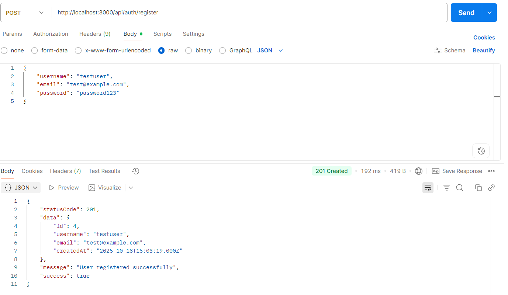
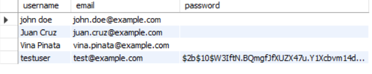

# User Registration and Password Laboratory
- Installed bcrypt via npm
- Altered the 'users' table to include a password
- Created a user registration Validator consisting of requiring username, email, and password.
- Modfied the user service for bcrypt.
- Created Controller and Route for the authentication when registering a user. Once created, Mounted the route in index.js

## Testing

