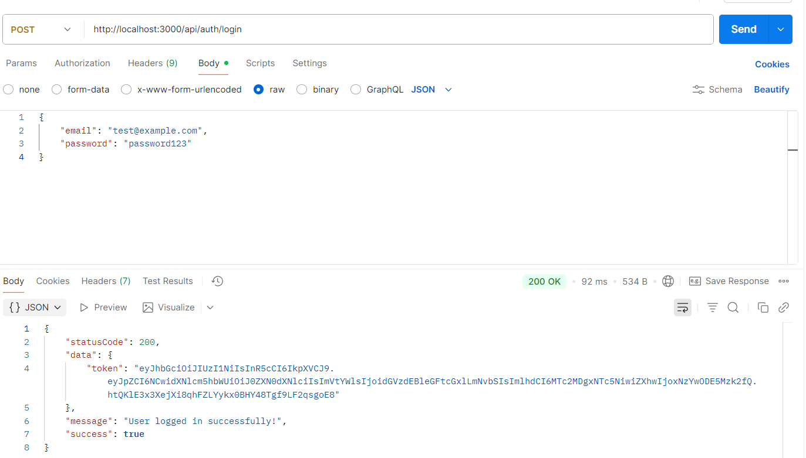

# User Login with JWT and Middleware Laboratory
- Install jsonwebtoken via npm.
- Modified .env to add JWT_SECRET, and imported to index.js
- Imported the JWT_SECRET from the .env to user.services.js and added a functionality of checking the user and its stored hash password.
- Modified both auth controller and routes for loginuser function.
- Created a new file for authentication middleware to check for a valid jwt.
- Added a new protected route.
- Updated functions from post controller, post service, and validator middleware since the authmiddleware has already attached logged-in user to req.user, making the former functions redundant.

## Testing
- 
- 
- 